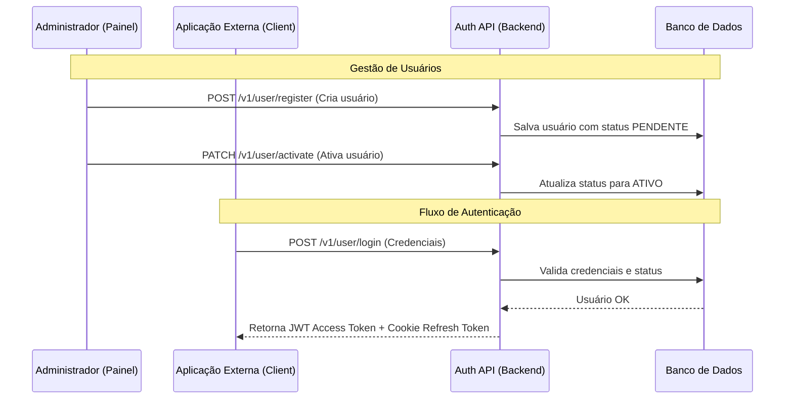
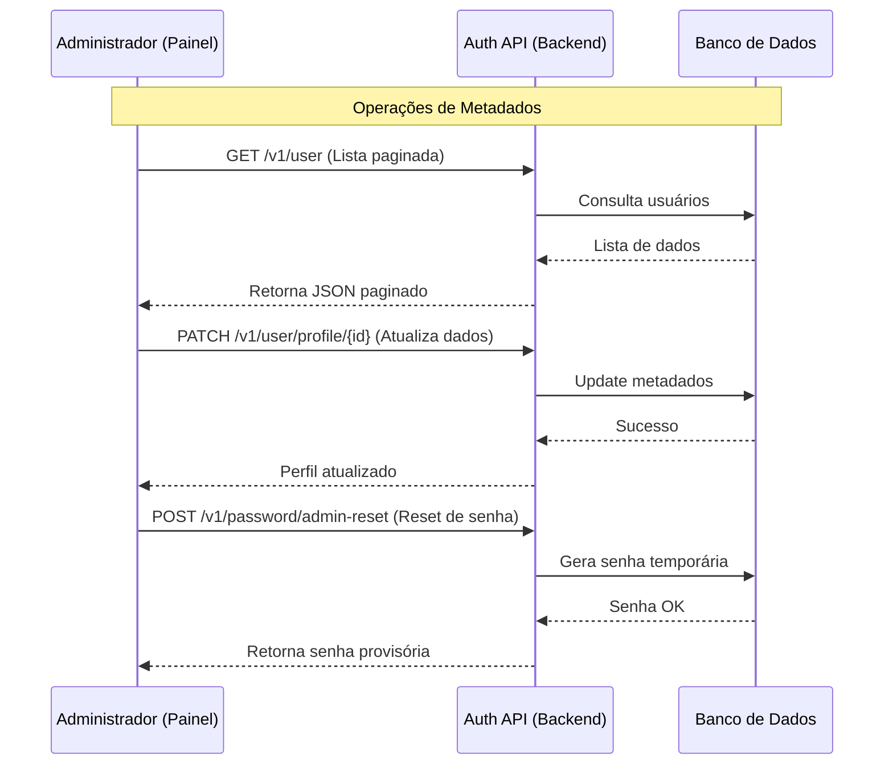

# System Auth - Spring JWT

Este projeto é um painel administrativo para controle de usuários e uma API de autenticação robusta para aplicações externas, utilizando tokens JWT.

## Principais Acessos

- `/` : Interface do Painel Administrativo (Frontend).
- `/swagger-ui.html` : Documentação interativa e testes da API (Swagger/OpenAPI).

## Intuito do Projeto

O sistema centraliza a gestão de identidade, permitindo que administradores controlem o ciclo de vida dos usuários (criação, ativação, desativação). Ele expõe endpoints para que outras aplicações realizem autenticação de forma segura e padronizada.

### Funcionalidades:

- **Gestão de Usuários**: Listagem paginada, ativação e desativação de contas.
- **Segurança**: Autenticação via JWT com suporte a Refresh Token via Cookie HttpOnly.
- **Controle de Senhas**: Troca voluntária, primeiro acesso e reset administrativo.
- **Perfis**: Consulta e atualização de metadados de perfil.

## Fluxo de Autenticação e Registro

Abaixo, o diagrama detalha como um administrador cria usuários e como o processo de login funciona para aplicações externas.

## Gestão de Metadados e Operações Administrativas

Este fluxo descreve como o sistema lida com a manutenção de dados e status dos usuários após o registro.

## Como Conectar e Chamar Operações

Para integrar sua aplicação com este serviço, utilize os endpoints conforme as categorias abaixo:

### 1. Autenticação e Sessão (`/v1/user`)

- **Login**: `POST /login` - Retorna `accessToken` no corpo e define `refresh_token` no cookie.
- **Refresh**: `POST /refresh` - Usa o cookie de refresh para renovar o acesso.
- **Logout**: `POST /logout` - Invalida o cookie de sessão.
- **Perfil**: `GET /profile` - Retorna os dados do usuário logado (Requer Bearer Token).

### 2. Gestão de Usuários e Registro

- **Registro**: `POST /v1/user/register` - Cria novo usuário (Apenas Admin).
- **Registro Admin**: `POST /v1/user/register/admin` - Cria novo administrador.
- **Listagem**: `GET /v1/user` - Lista usuários com paginação (Apenas Admin).
- **Ativação**: `PATCH /v1/user/activate?id={uuid}` - Ativa conta.
- **Desativação**: `PATCH /v1/user/deactivate?id={uuid}` - Suspende conta.
- **Atualizar Perfil**: `PATCH /v1/user/profile/{id}` - Altera metadados do usuário.

### 3. Gestão de Senhas (`/v1/password`)

- **Troca de Senha**: `POST /change` - Altera a própria senha (Autenticado).
- **Primeiro Acesso**: `POST /first-change` - Define senha após reset ou criação.
- **Reset Admin**: `POST /admin-reset` - Gera nova senha para o usuário (Apenas Admin).

---

Desenvolvido por Vinícius Gabriel Pereira Leitão.
