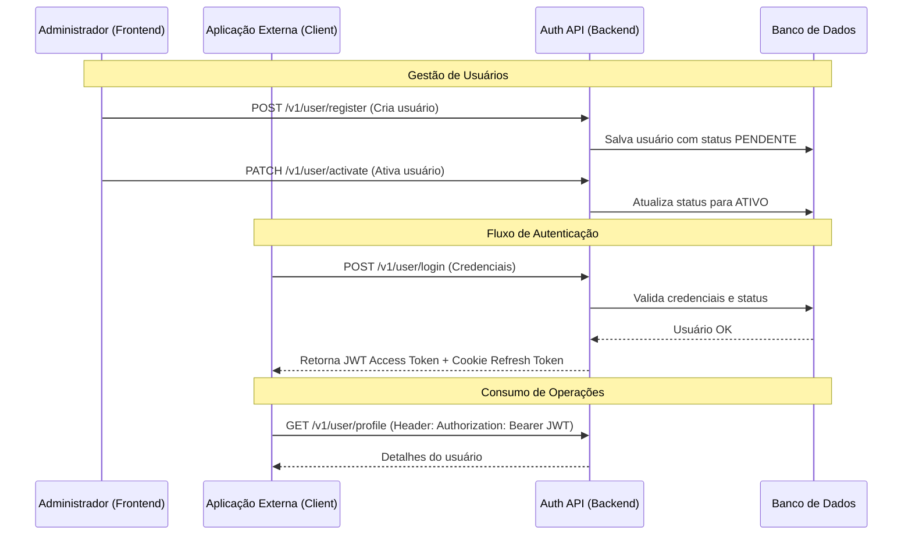

# System Auth - Spring JWT

Este projeto é um painel administrativo para controle de usuários e uma API de autenticação para aplicações externas.

## Principais Rotas

- `/` : Acesso ao frontend (Painel Administrativo).
- `/swagger-ui.html` : Documentação interativa da API (Swagger/OpenAPI).

## Intuito do Projeto

O objetivo principal é oferecer um **Painel Admin** centralizado para criação, ativação, desativação e manipulação de usuários. Além disso, o sistema expõe endpoints públicos para que outras aplicações possam se conectar e realizar a autenticação de seus usuários através de tokens JWT.

### Funcionalidades:

- Gestão de usuários (Admin).
- Login e renovação de token (Público).
- Reset de senha (Admin e Primeiro Acesso).
- Documentação automática via Swagger.

## Workflow de Integração

Abaixo, o diagrama mostra como um administrador gerencia o sistema e como aplicações externas consomem os serviços de autenticação.

## Como Conectar e Chamar Operações

Para integrar sua aplicação com este serviço de autenticação, siga os passos abaixo:

1. **Login**: Envie as credenciais para `/v1/user/login`. Você receberá um `accessToken` no corpo da resposta e um `refresh_token` via cookie `HttpOnly`.
2. **Autorização**: Utilize o `accessToken` no header de todas as requisições protegidas: `Authorization: Bearer <token>`.
3. **Perfil**: Acesse `/v1/user/profile` para validar o token e obter dados do usuário logado.
4. **Refresh**: Quando o token expirar, chame `/v1/user/refresh` enviando o cookie de refresh para obter um novo par de tokens.

---

Desenvolvido por Vinícius Gabriel Pereira Leitão.
